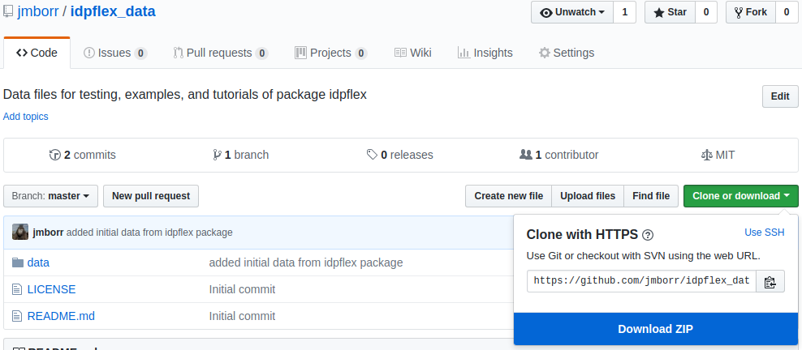
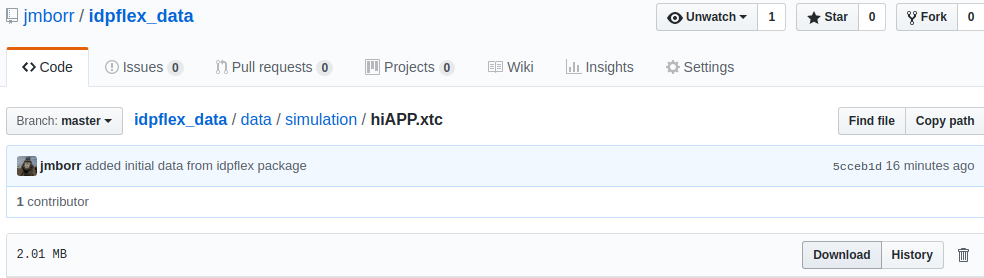
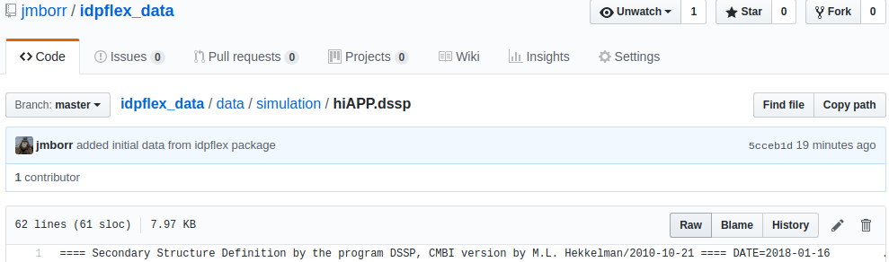

.. highlight:: shell

============
Installation
============

Requirements
------------

- Operative system: Linux or iOS

Stable release
--------------

To install idpflex, run this command in your terminal:

.. code-block:: console

    $ pip install idpflex

This is the preferred method to install idpflex, as it will always install the most recent stable release.

If you don't have `pip`_ installed, this `Python installation guide`_ can guide
you through the process.

.. _pip: https://pip.pypa.io
.. _Python installation guide: http://docs.python-guide.org/en/latest/starting/installation/

From sources
------------

The sources for idpflex can be downloaded from the `Github repo`_.

You can either clone the public repository:

.. code-block:: console

    $ git clone git://github.com/jmborr/idpflex

Or download the `tarball`_:

.. code-block:: console

    $ curl  -OL https://github.com/jmborr/idpflex/tarball/master

Once you have a copy of the source, you can install it with:

.. code-block:: console

    $ python setup.py install

.. _Github repo: https://github.com/jmborr/idpflex
.. _tarball: https://github.com/jmborr/idpflex/tarball/master

Testing & Tutorials Data
------------------------

The external repository `idpflex_data <https://github.com/jmborr/idpflex_data>`
contains all data files used in testing, examples, and tutorials.
There are several ways to obtain this dataset:

1. Clone the repository with a git command in a terminal:

.. code :: bash

    cd some/directory/
    git clone https://github.com/jmborr/idfplex_data.git

2. Download all data files as a zip file using GitHub's web interface:

3. Download individual files using GitHub's web interface by browsing to the
file. If the file is in binary format, then click in Download button:

If the file is in ASCII format, you must first click in the `Raw` view. After
this you can right-click and `Save as`.

